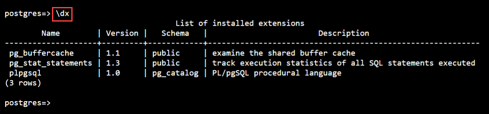
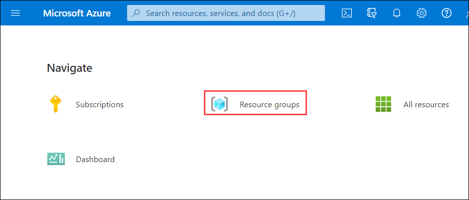
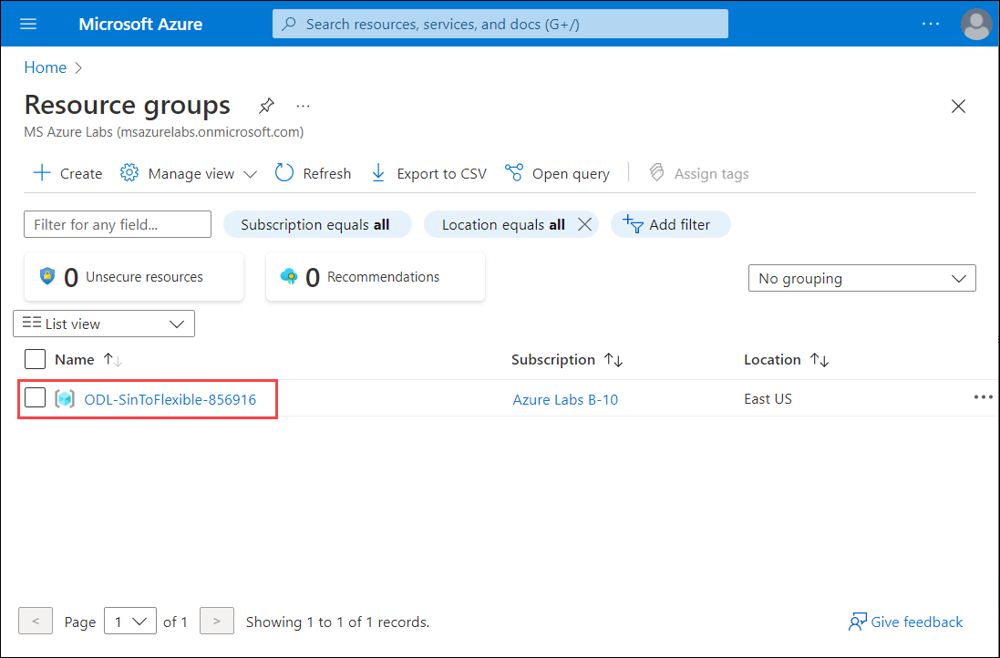
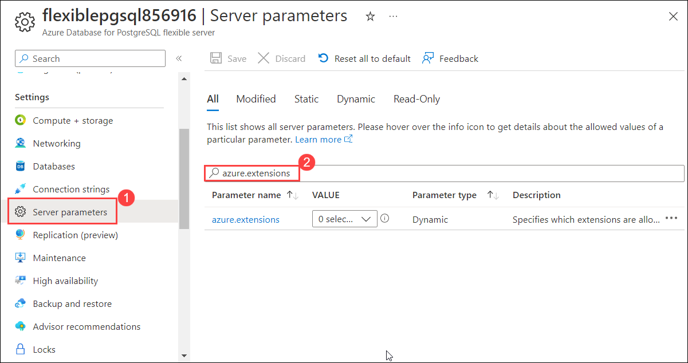
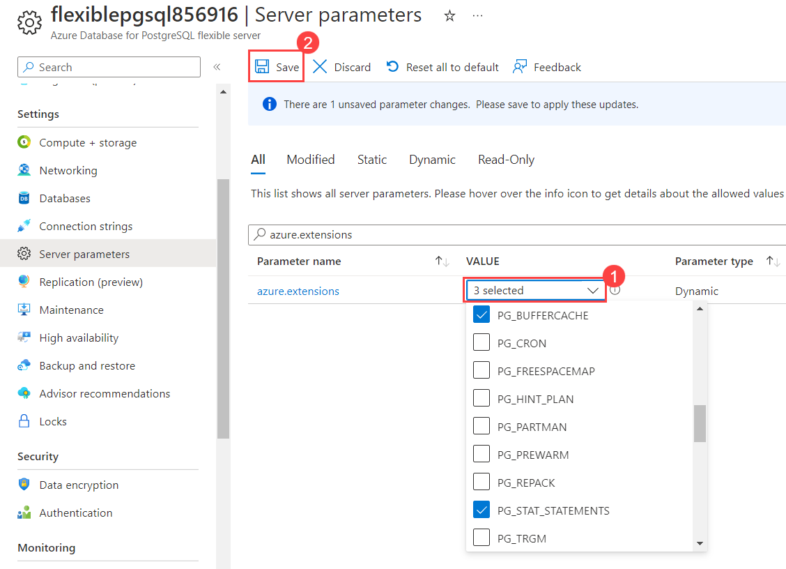
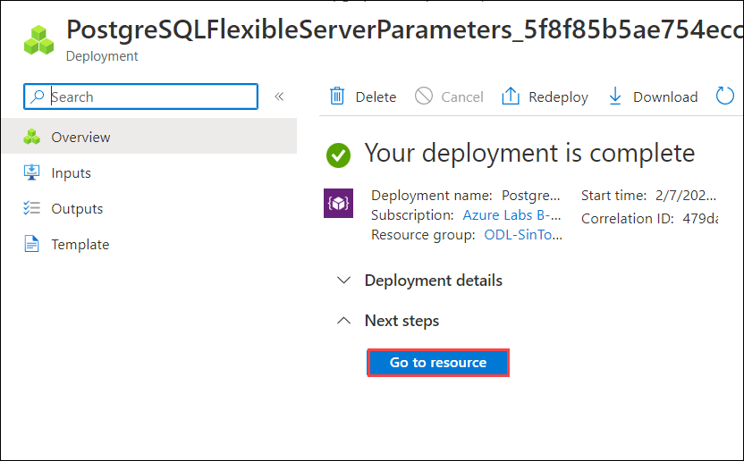

# Exercise -2 : Migating the data base using offline method


## Task 1 : Enable extension

1. In the **Azure portal**, open the Azure Cloud Shell by clicking on the cloud shell icon in the top menu bar.

    
2. After launching the Azure Cloud Shell, select the **Bash** option.

    
    
3. Now on You have no storage mounted dialog box click on **Show advanced settings**.

   
   
4. Follow the below mentioned instuctions and click on **Create Storage (3)**.

    - Storage account : Enter **stacc<inject key="DeploymentID" enableCopy="false"/> (1)**
    - File Share : Enter **blob (2)**

    
    
5. Follow the below steps to connect to the **Azure Database for PostgreSQL single server**:

   - Replace the **<DID>** with **<inject key="DeploymentID" enableCopy="true"/>** in the below command and run it from bash.
    
       ```bash
       psql --host=pgsql<DID>.postgres.database.azure.com --port=5432 --username=demouser@pgsql<DID> --dbname=postgres
       ```
   - Copy and paste the value **<inject key="PostGre SQL Password" enableCopy="true"/>** as Password and hit **Enter**
    
   
    
6. Run the below command in the Single Server databases to list all the extensions that are included and note it for further use.
    
    ```bash
    \dx
    ```
    
    
    
7. Minimize the bash and naviagte to Azure Portal.
    
8. In Azure Portal, click on **Resource groups** from the Navigate panel.
    
    
    
9. From the Resource groups page, click on **ODL-SinToFlexible-<inject key="DeploymentID" enableCopy="false"/>**.
    
    
    
10. From the **Overview (1)** tab select the Azure Database for PostgreSQL flexible server **flexiblepgsql<inject key="DeploymentID" enableCopy="false"/> (2)**.
    
    

11. Navigate to **Server Parameters (1)** blade under settings, and search for  **azure.extensions (2)** in the search bar.
    
    
    
12. Select the list of extensions obtained by running the command in step-6 on your Single server database to this server parameter and click **Save**.
    
    
    
    
    > **Note :** You should wait for the deployment to complete before proceeding further.
       
13. Once the deployment is succeeded, click on **Go to resource**.
    
    
