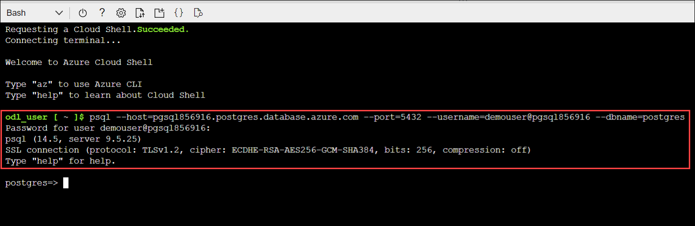

# Exercise -2 : Migating the data base using offline method


## Task 1 : Enable extension

1. In the **Azure portal**, open the Azure Cloud Shell by clicking on the cloud shell icon in the top menu bar.

    
2. After launching the Azure Cloud Shell, select the **Bash** option.

    
    
3. Now on You have no storage mounted dialog box click on **Show advanced settings**.

   
   
4. Follow the below mentioned instuctions and click on **Create Storage (3)**.

    - Storage account : Enter **stacc<inject key="DeploymentID" enableCopy="false"/> (1)**
    - File Share : Enter **blob (2)**

    
    
5. Follow the below steps to connect to the **Azure Database for PostgreSQL single server**:

   - Replace the **<DID>** with **<inject key="DeploymentID" enableCopy="true"/>** in the below command and run it from bash.
    
       ```bash
       psql --host=pgsql<DID>.postgres.database.azure.com --port=5432 --username=demouser@pgsql<DID> --dbname=postgres
       ```
   - Copy and paste the value **<inject key="PostGre SQL Password" enableCopy="true"/>** as Password and hit **Enter**
    
   
    
       
       
