# Exercise -2: Migrating the database from a Single PostgreSQL server to Flexible PostgreSQL Server using an offline method

In this exercise, you will be migrating the database from a Single PostgreSQL server to a Flexible PostgreSQL Server using the new Migration (Preview) tool.

## Task 1: Enable extension

1. In the **Azure portal**, open the Azure Cloud Shell by clicking on the cloud shell icon in the top menu bar.

    
2. After launching the Azure Cloud Shell, select the **Bash** option.

    
    
3. Now on You have no storage mounted dialog box click on **Show advanced settings**.

   
   
4. Follow the below-mentioned instructions and click on **Create Storage (3)**.

    - Storage account : Enter **stacc<inject key="DeploymentID" enableCopy="false"/> (1)**
    - File Share : Enter **blob (2)**

    
    
5. Follow the below steps to connect to the **Azure Database for PostgreSQL single server**:

   - Replace the `<DID>` with **<inject key="DeploymentID" enableCopy="true"/>** in the below command and run it from bash.
    
       ```bash
       psql --host=pgsql<inject key="DeploymentID" enableCopy="false"/>.postgres.database.azure.com --port=5432 --username=demouser@pgsql<DID> --dbname=postgres
       ```
   - Copy and paste the value **<inject key="PostGre SQL Password" enableCopy="true"/>** as Password and hit **Enter**
    
   
    
6. Run the below command in the Single Server databases to list all the extensions that are included and note them for further use.
    
    ```bash
    select * from pg_extension;
    ```
    
    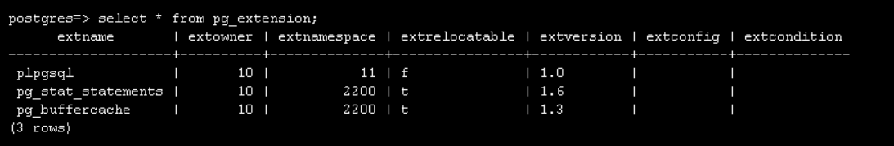
    
7. Minimize the bash and navigate to Azure Portal.
    
8. In Azure Portal, click on **Resource groups** from the Navigate panel.
    
    
    
9. From the Resource groups page, click on **ODL-SinToFlexible-<inject key="DeploymentID" enableCopy="false"/>**.
    
    
    
10. From the **Overview (1)** tab select the Azure Database for PostgreSQL flexible server **flexiblepgsql<inject key="DeploymentID" enableCopy="false"/> (2)**.
    
    

11. Navigate to **Server Parameters (1)** blade under settings, and search for  **azure.extensions (2)** in the search bar.
    
    
    
12. Select the list of extensions obtained by running the command in step-6 on your Single server database to this server parameter and click **Save**.
    
    
    
    
    > **Note:** You should wait for the deployment to complete before proceeding further.
       
13. Once the deployment has succeeded, click on **Go to resource**.
    
    

    
## Task 2: Migrate Data Base from Azure Database for PostgreSQL single server

    
1. Now navigate back to **Azure Database for PostgreSQL Flexible Server** resource page and select **Migration (1)** and click on **+ Migration from Single Server (2)**.
    
     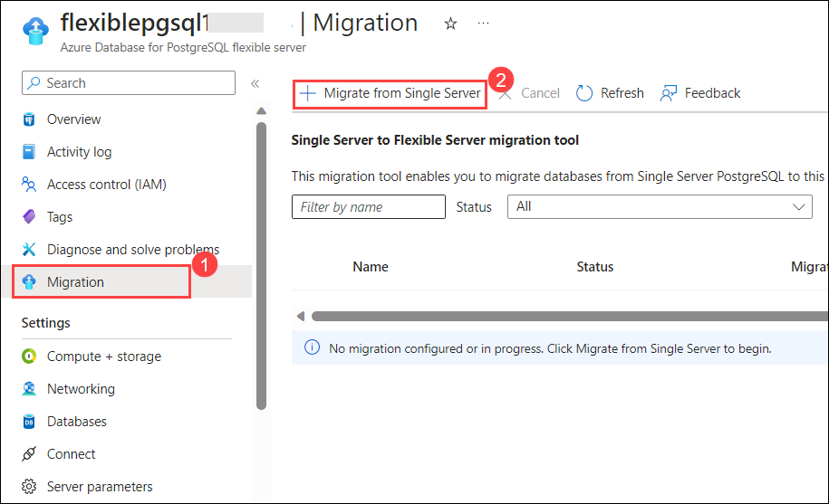
    
2. On the **Setup** page, follow the below instructions:
    
    - Migration name : Enter **Migrate-single-to-flexible-server (1)**
    - click on **Next : Source > (2)**.
    
     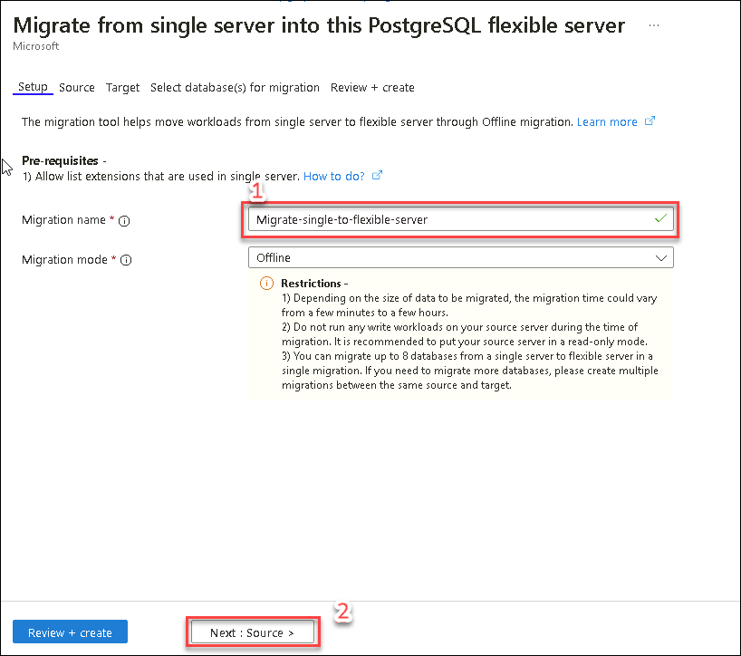

 3. On the **Source** tab, follow the below-mentioned instructions:
    
    - Subscription: Choose the default subscription **(1)**
    - Resource group : Choose **ODL-SinToFlexible-<inject key="DeploymentID" enableCopy="true"/> (2)** from drop-down list
    - Server name: Leave it as **Default (3)**
    - Password : Enter the value **<inject key="PostGre SQL Password" enableCopy="true"/> (4)**
    - Choose databases to migrate (up to 8): Check the box next to **Sampledb (5)**
    - Migration mode: Choose **Offline (6)** from the drop-down list.
    - Click on **Next : Target > (7)**.
    
    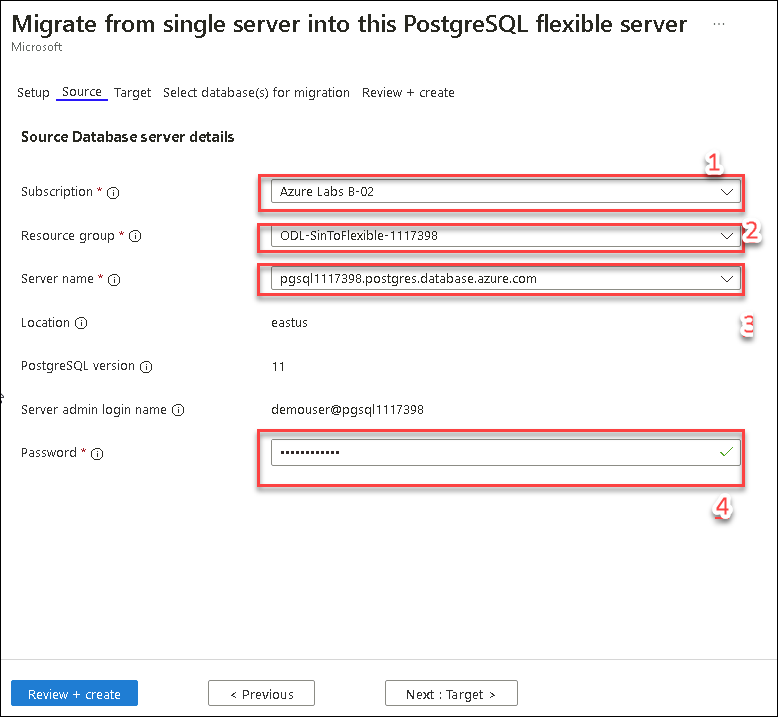
    
 4. Under the **Target** tab, follow the below-mentioned instructions:
    
    - Subscription: Choose the default subscription **(1)**
    - Resource group : Choose **ODL-SinToFlexible-<inject key="DeploymentID" enableCopy="true"/> (2)** from drop-down list
    - Server name: Leave it as **Default (3)**
    - Password : Enter the value **<inject key="PostGre SQL Password" enableCopy="true"/> (4)**
    - Click on **Select database(s) for migration > (5)**.
    
    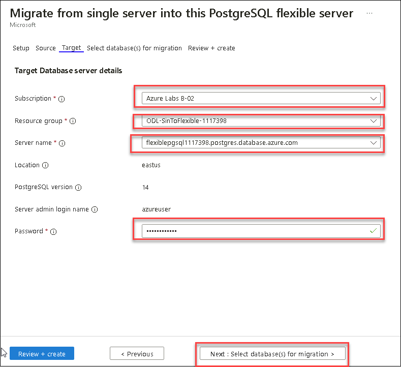
        
5. On the select database page, select **sampledb** database (1) and click on **Next: Review + Create >** button.
    
    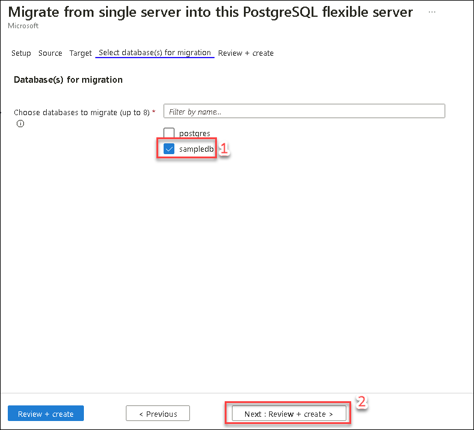
    
    > **Info:** After you hit the Create button, a notification appears in a few seconds to say that the migration was successfully created. 
    
6. You should automatically be redirected to the **Migration** page of Flexible Server. It should have a new entry for the recently created migration.
    
    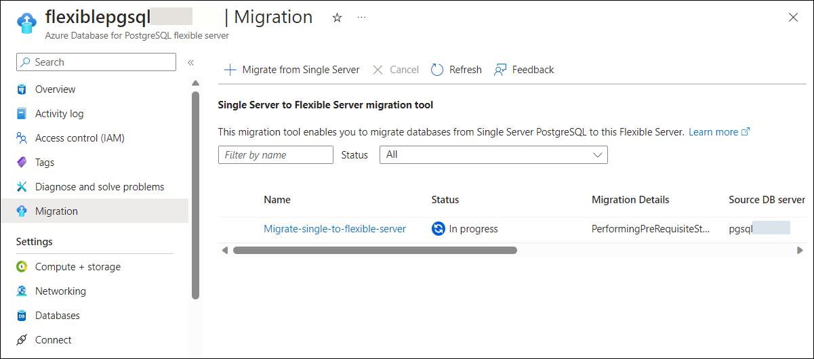

7. Select the migration name in the grid to see the details of that migration.
    
    
    
8. Click on the **Refresh** button to get the latest status of the migration. Over time, the migration will succeed or fail with appropriate errors.
   
9. Once the migration has succeeded, you should be able to see the database listed with the status as **Complete**.
    
    

10. Navigate back to **flexiblepgsql<inject key="DeploymentID" enableCopy="false"/>** and select **Databases (1)** from left menu under Settings. Now you will be able to see the migrated database **sampledb (2)**.
    
    

11. Now click on **Connect** to connect to the database.

    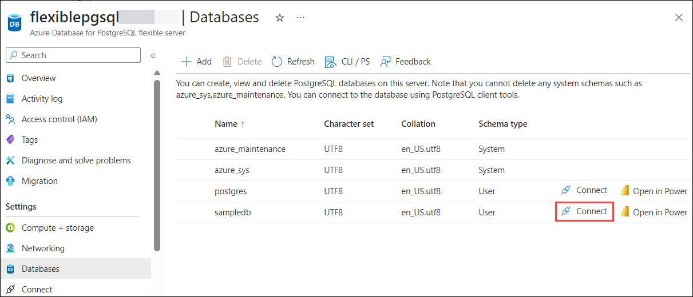
    
12. Click on **Yes** on the pop-up to allow the firewall settings.

    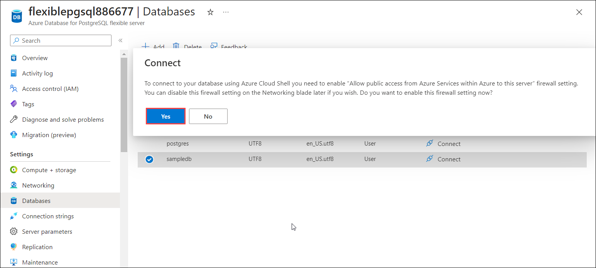
    
13. Wait for 1-2 minutes until the firewall rules get updated and you may need to enter your server password to connect to the cloud shell.

      - Enter the password **<inject key="PostGre SQL Password" enableCopy="true"/>**
      
      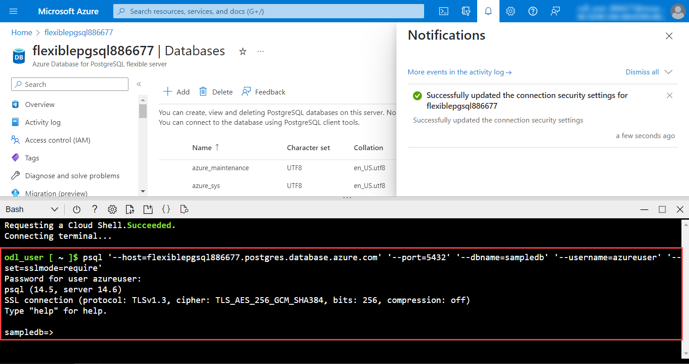
      
14. Minimize the Azure Portal window and search for **Command Prompt (1)** from the Windows Start menu and select it **(2)**.

    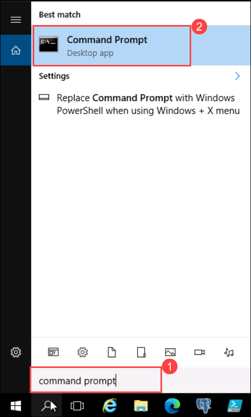
    
15. Run the below-given commands to migrate users and roles:

    ```
    cd C:\Program Files\PostgreSQL\11\bin
    ```
                                                                                     
    - Replace the `<DID>` with **<inject key="DeploymentID" enableCopy="true"/>** in the below command and run it.
    ```
    pg_dumpall -r --host=pgsql<DID>.postgres.database.azure.com --port=5432 --username=demouser@pgsql<DID> --database=sampledb > roles.sql
    ```
    
    - Replace the `<DID>` with **<inject key="DeploymentID" enableCopy="true"/>** in the below command and run it.
    ```
    psql -f roles.sql --host=flexiblepgsql<DID>.postgres.database.azure.com --port=5432 --username=azureuser --dbname=sampledb
    ```
  
   > **Note:** The dump script shouldn't be expected to run completely without errors. In particular, because the script will issue CREATE ROLE for every role existing in the source cluster, it's certain to get a “role already exists” error for the bootstrap superuser like azure_pg_admin or azure_superuser. This error is harmless and can be ignored. 
   
16. Navigate back to Azure Portal where you connected to Bash and run the below command to see the migrated tables from the Single Postgres server.
    
    ```
    \dt
    ```
    
    
    
17. Run the below command to see the migrated roles from the Single Postgres server.

    ```
    \du
    ```
    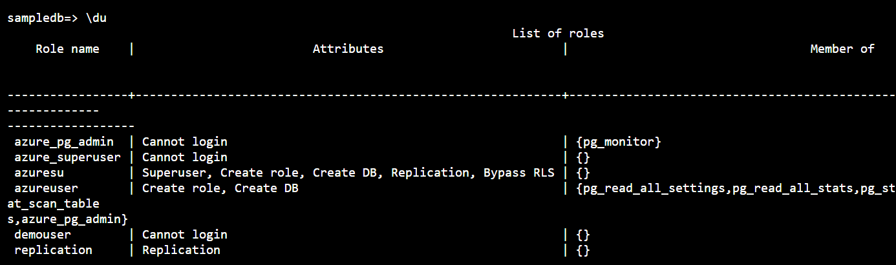
    
    >**Note:** Here you can observe both the usernames of single and flexible serves which are ```azureuser``` and ```demouser```.
    
18. You can also create roles by editing the **roles.sql** file.

19. You can also create new roles by following the below-given steps: 

   -  Navigate to the path **C:\Program Files\PostgreSQL\11\bin (1)** and select the file **roles.sql (2)**.

      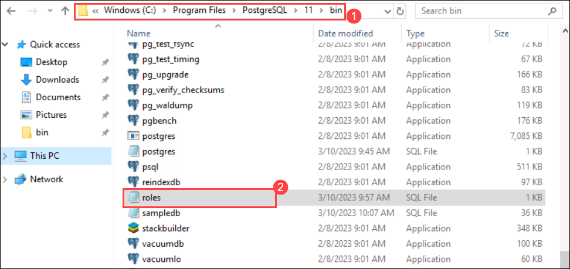

   - Right-click on **roles.sql** **(1)** file, and then select **Open With** **(2)**.

      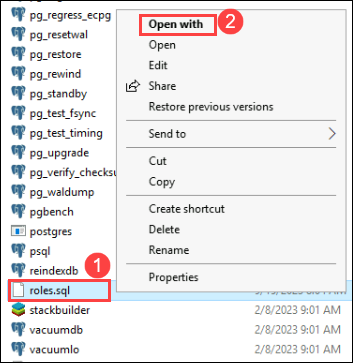
   
   - Select **Notepad** **(1)**, and click on **Ok** **(2)**.

      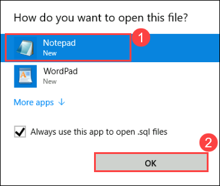
   
   - Add the below-mentioned command and save the file.

      ```
      CREATE ROLE sqluser;
      ```
      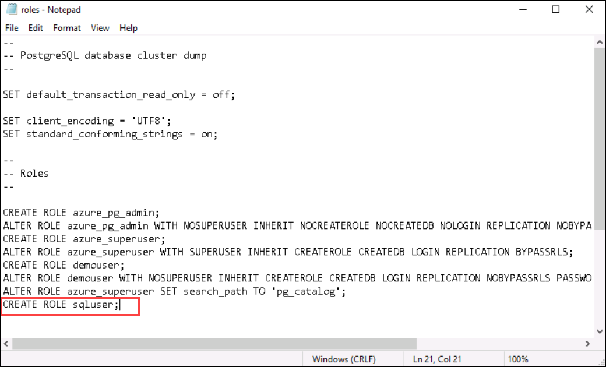
     
   - Navigate back to the command prompt and run the below command:

     ```
     psql -f roles.sql --host=flexiblepgsql<DID>.postgres.database.azure.com --port=5432 --username=azureuser --dbname=sampledb
     ```
    
     >**Note:** Replace the `<DID>` with **<inject key="DeploymentID" enableCopy="true"/>** in the below command and run it.

20. Navigate back to Azure Portal where you have connected to sampledb server and run the below command to view the newly created role

   ```
   \du
   ```
   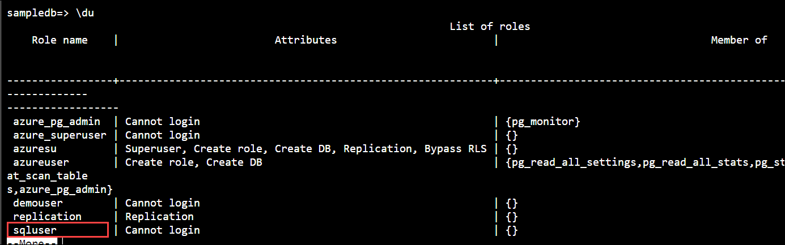 

  
   
## Summary

In this exercise, you have covered the following:

- Enabled the required extension in a flexible server.
- Migrated the Data Base from Azure Database for PostgreSQL single server

   
