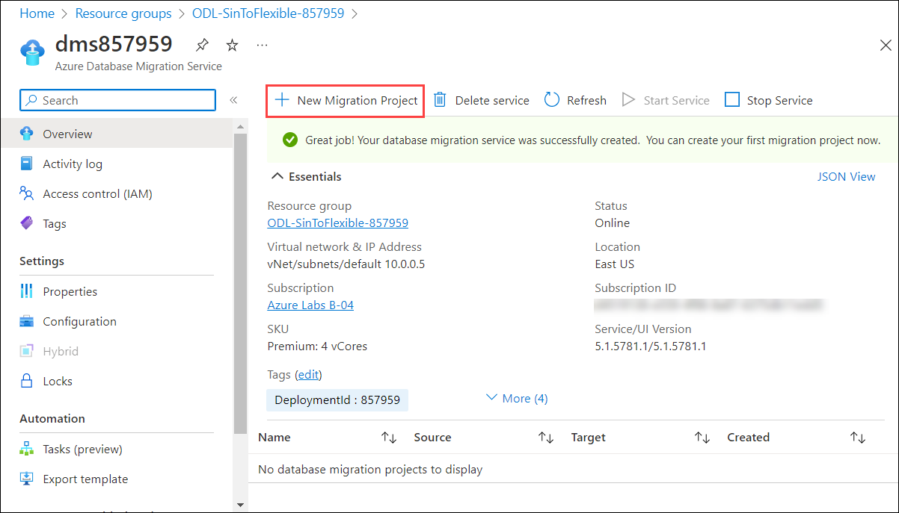
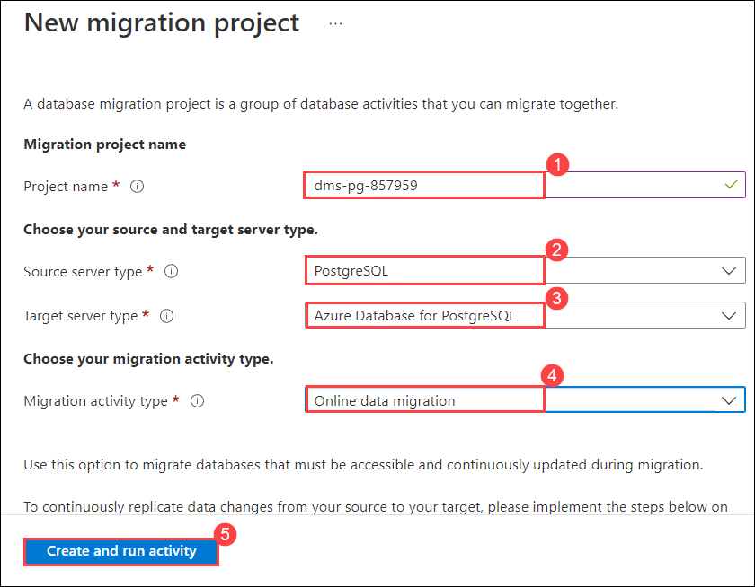

# Exercise -3 : Migating the database using online method

## Task 1: 

1. In Azure Portal, click on **Resource groups** from the Navigate panel.
    
    
    
2. From the Resource groups page, click on **ODL-SinToFlexible-<inject key="DeploymentID" enableCopy="false"/>**.
    
    
    
3. From the **Overview (1)** tab select the Azure Database for PostgreSQL flexible server **dms<inject key="DeploymentID" enableCopy="false"/> (2)**.
    
    
    
4. On the **Azure Database Migration Services** page, clcik on **+ New migration project**.

    
    
5. On **New migration project** page, follow the below given instrcutions:

   - Project name : Enter **dms-pg-<inject key="DeploymentID" enableCopy="false"/> (1)**
   - Source server type : Choose **PostgreSQL (2)** from drop-down list.
   - Target server type : Choose **Azure Database for PostgreSQL (3)** from the drop-down
   - Migration activity type : Choose **Online data migration (4)** from the drop-down list.
   - Click on **Create and run activity (5)**

   
   
   > **Info :** The activity will take around 5 minutes to complete. Once it's created, you will be navigated to **PostgreSQL to Azure Database for PostgreSQL Online Migration Wizard** page.

6. 
