# Exercise -3 : Migating the database using online method

## Task 1: 

1. In Azure Portal, click on **Resource groups** from the Navigate panel.
    
    
    
2. From the Resource groups page, click on **ODL-SinToFlexible-<inject key="DeploymentID" enableCopy="false"/>**.
    
    

3. From the **Overview (1)** tab, select **pgsql<inject key="DeploymentID" enableCopy="false"/>**.

    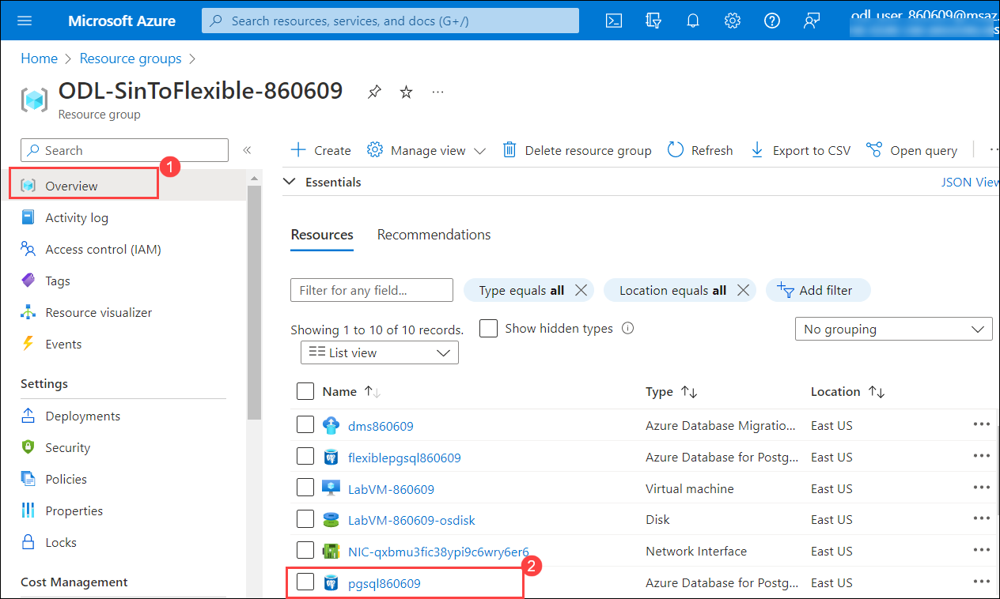
    
4. Follow the below instructions on **pgsql<inject key="DeploymentID" enableCopy="false"/>** page:

   - Click on **Replication (1)** under Settings.
   - Azure replication support : Choose **Logical (2)**.
   - Click on **Save (3)**.

   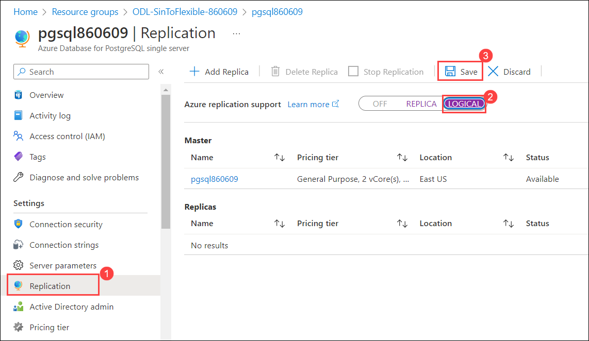
   
6. From the **Overview (1)** tab select the Azure Database for PostgreSQL flexible server **dms<inject key="DeploymentID" enableCopy="false"/> (2)**.
    
    
    
4. On the **Azure Database Migration Services** page, clcik on **+ New migration project**.

    
    
5. On **New migration project** page, follow the below given instrcutions:

   - Project name : Enter **dms-pg-<inject key="DeploymentID" enableCopy="false"/> (1)**
   - Source server type : Choose **PostgreSQL (2)** from drop-down list.
   - Target server type : Choose **Azure Database for PostgreSQL (3)** from the drop-down
   - Migration activity type : Choose **Online data migration (4)** from the drop-down list.
   - Click on **Create and run activity (5)**

   
   
   > **Info :** The activity will take around 5 minutes to complete. Once it's created, you will be navigated to **PostgreSQL to Azure Database for PostgreSQL Online Migration Wizard** page.

6. Under **Select Source** page, follow the below instructions:

   - Source server name :  Enter **pgsql<inject key="DeploymentID" enableCopy="false"/>.postgres.database.azure.com (1)**
   - Server port : Enter **5432 (2)**
   - Database : Enter **sampledb (3)**
   - User Name : Enter **demouser@pgsql<inject key="DeploymentID" enableCopy="false"/> (4)**
   - Password : Enter **<inject key="PostGre SQL Password" enableCopy="true"/> (5)**
   - Chec the box next to **Trust server certificate (6)**
   - Click on **Next : Select target > > (7)**

    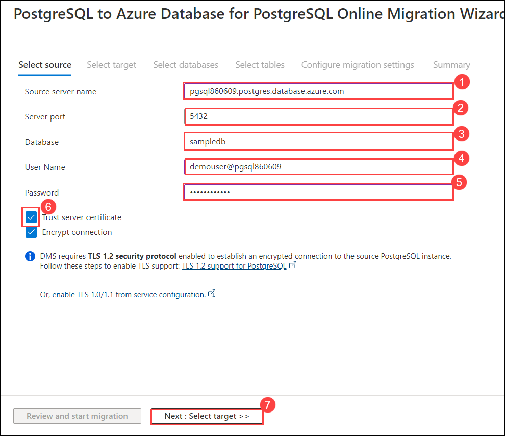
    
 7. Under **Select Target** pagem follow the below instructions:

   - Subscription : Leave suscription as **Defalut (1)**
   - Azure PostgreSQl : Choose **flexiblepgsql<inject key="DeploymentID" enableCopy="false"/> (2)** from the drop down list.
   - Database : Enter **Postgres (3)**
   - User Name : Enter **demouser (4)**
   - Password : Enter **<inject key="PostGre SQL Password" enableCopy="true"/> (5)**
   - Select **Next : Select databases > > (6)**

   
   
8. On **Select databases** tab, follow the below instuctions:

   -  Check the box next to **sampledb (1)**
   -  Target database: Choose **postgres (2)** from drop-down list.
   -  Click on **Next : Select tables > > (3)**

   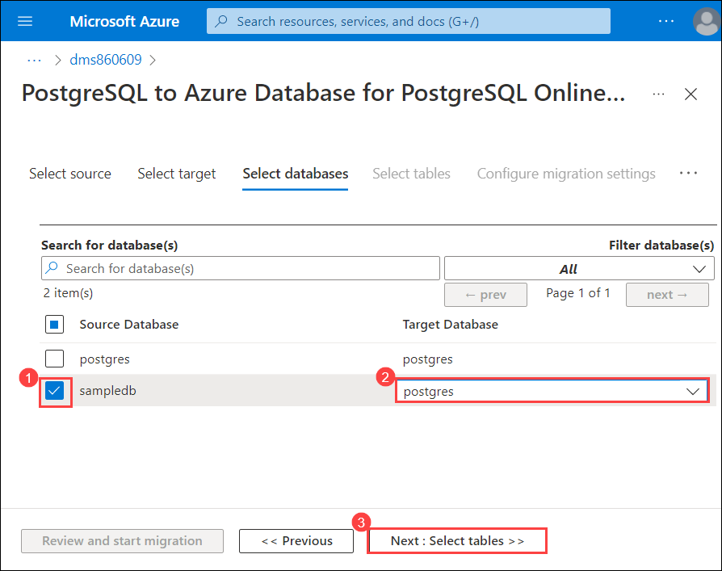
   
9. On **Select tables** tab, expand **sampledb (1)** and verify the tables then click on **Next : Configure migration settings > > (2)**.

   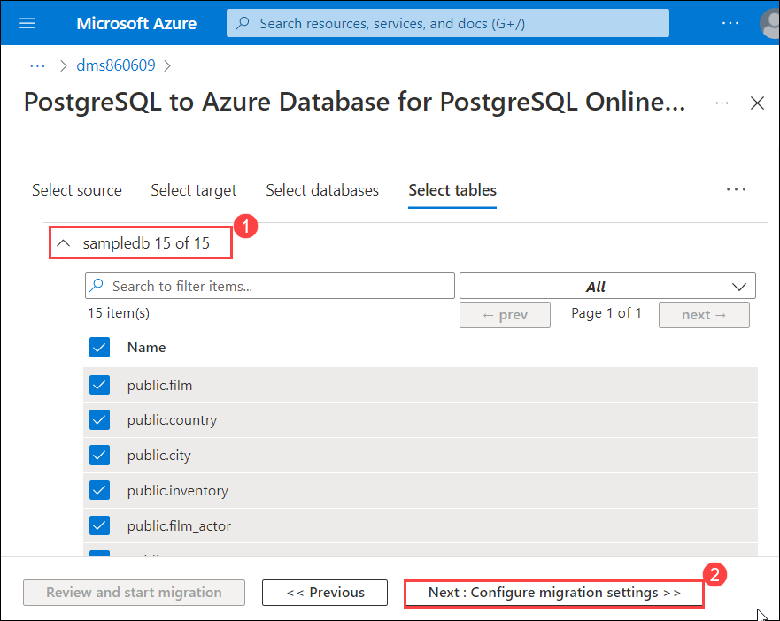
   
10. On **Configure migration settings** tab, leave everything as default and cilck on **Next : Summary > >**.

    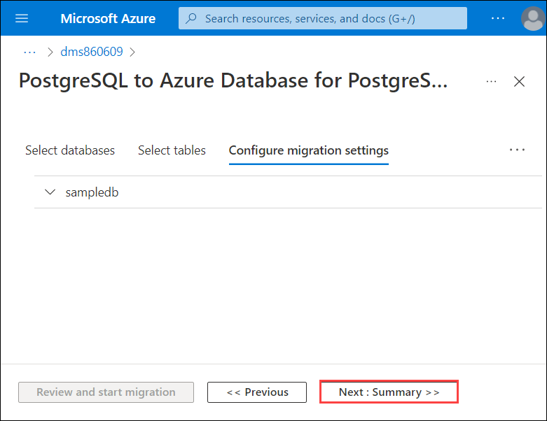
    
11. On **Summary**, enter the **Activity name** as **migratedb (1)** and click on **Start migration (2)**.

     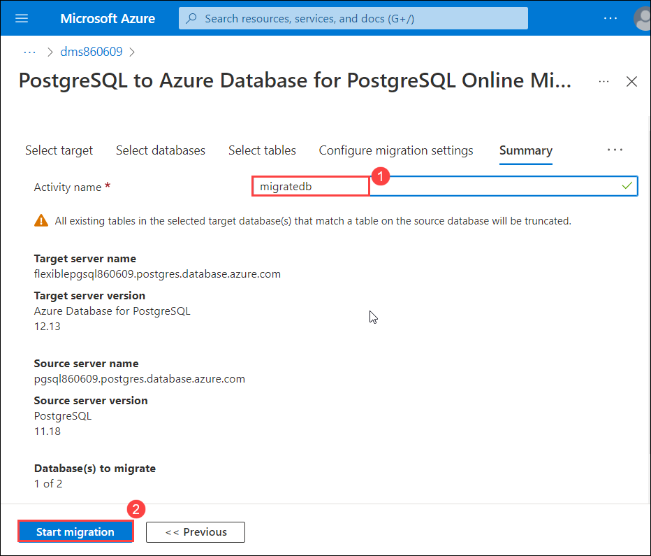
     
12. Once the migration has started, you will naviagte to migratedb page. Click on **Refresh** periodically to get the current status.

     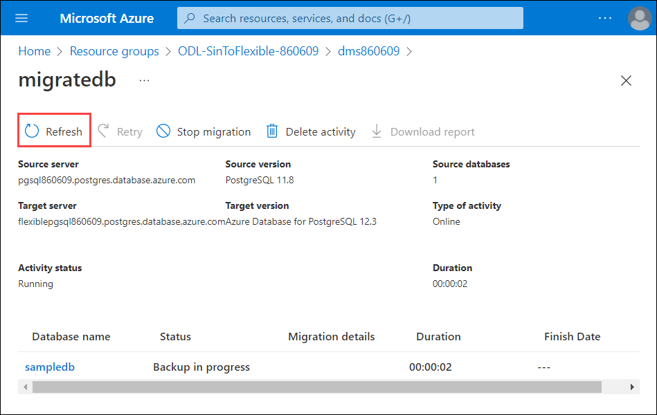
     
13. Select the database **sampledb** once you are able to see the Migration details as **Ready to cutover**.

    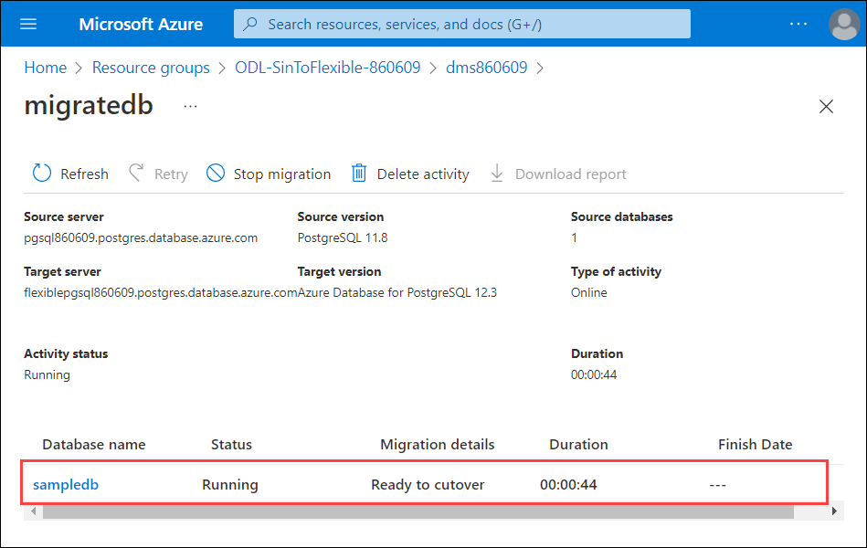
    
14. On **sampledb** page, follow the below instructions:

    - Click on **Start cutover (1)**
    - Make sure the **Pending changes** count as **0 (2)**
    - Check the box next to **Confirm (3)**
    - Click on **Apply (4)**

    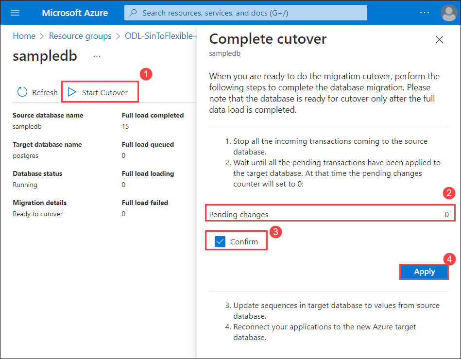
    
15. Once the cutover is completed, click on **X**.

    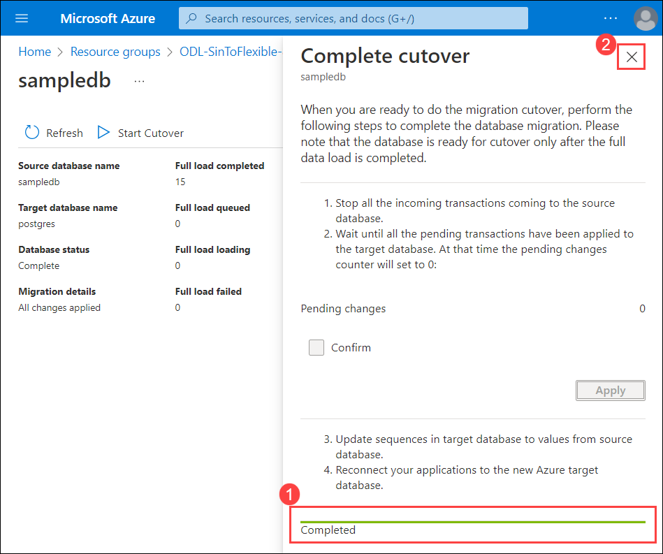
    
16. Navigte back to **migratedb** page to check the migration process. After the database has migrated, you can observe the **Activity status** as **Succeeded**.

    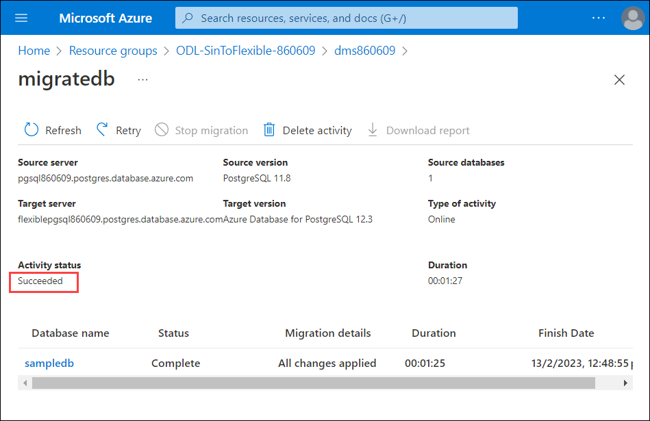
