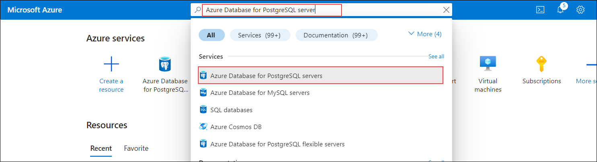
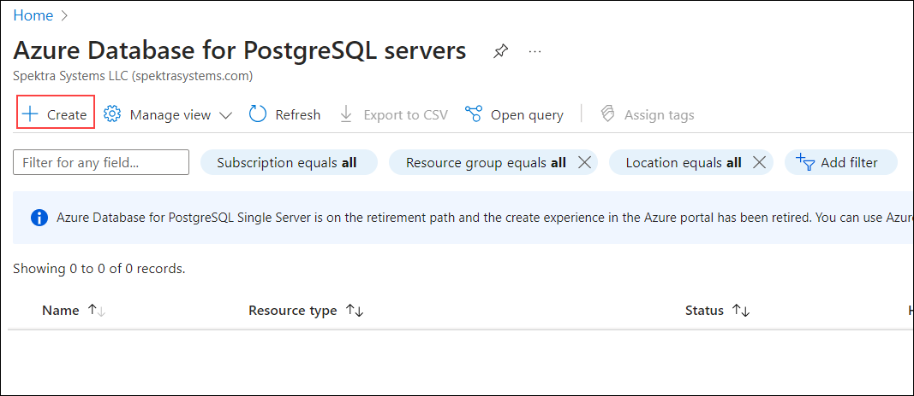
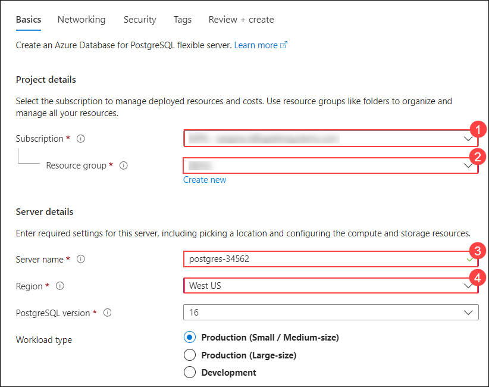
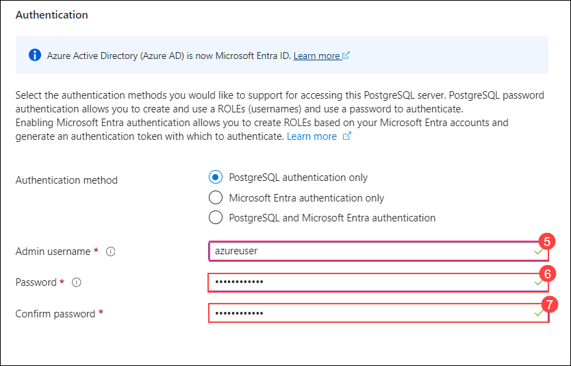
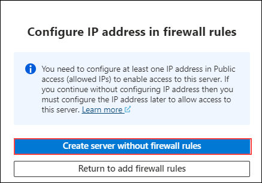

# Lab 1: Deploy Azure Database for PostgreSQL

1. In the Azure portal, in the **Search resources, services,and Docs (G+/)** bar search for **Azure Database for PostgreSQL servers** and click on it.

    

2. In the **Azure Database for PostgreSQL servers** page, click on **Create**.

    

3. In the **Basics** tab, fill in the following details and leave the others as default and click on **Review and Create** and subsequently click on **Create**:

     |Setting|Value|
     |:----|:----|
     |**Subscription**|Leave it as default (1)|
     |**Resource Group**| (2)|
     | **Server name**|**postgres** (3)|
     |**Admin Username** |**azureuser** (4)|
     |**Password** |**Password.1!!** (5)|
     |**Confirm Password** |**Password.1!!**(6)|
  
     
  
     

4. In the pop-up that appears in the **Configure IP address in Firewall Rules** click **Create server without firewall rules**
   
   

5.

   

   
